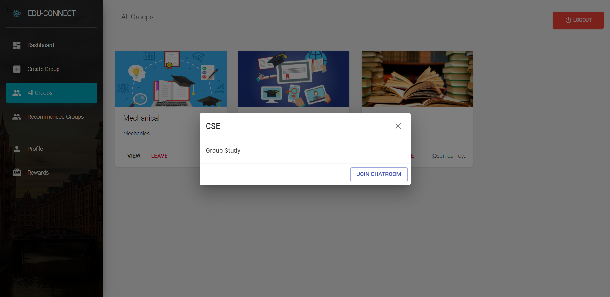

## Microsoft Engage Project

### Project Description

    - A virtual collaborative learning platform which connects students with similar interests.
    - This overcomes problems such as finding like minded peers based on specific interests and lost human connection.

### Features
    - User authentication (Login/ Signup)
    - User Profile
    - Rewards for users; to motivate the users 
    - List of all groups
    - List of recommended groups based on user's weaknesses
    - Creating a group
    - Deleteing a group (only the ones created by the user)
    - Join a group
    - Leaving a group
    - A Chat Room
    
### Project Structure

    - Chat Room : Application for the chatroom
    - Frontend : Contains the client side pages and components 
    
### Tech Stack

    - React Js
    - Node Js
    - MongodB Atlas
    - Express Js

### How to run ?

    - In your root folder
    - npm install
    - nodemon server
    
    - cd frontend && npm install  
    - npm start

### Deployment

    - Deployed in Heroku
    - Deployed link: https://ms-sumashreya.herokuapp.com/
    
### Screenshots

